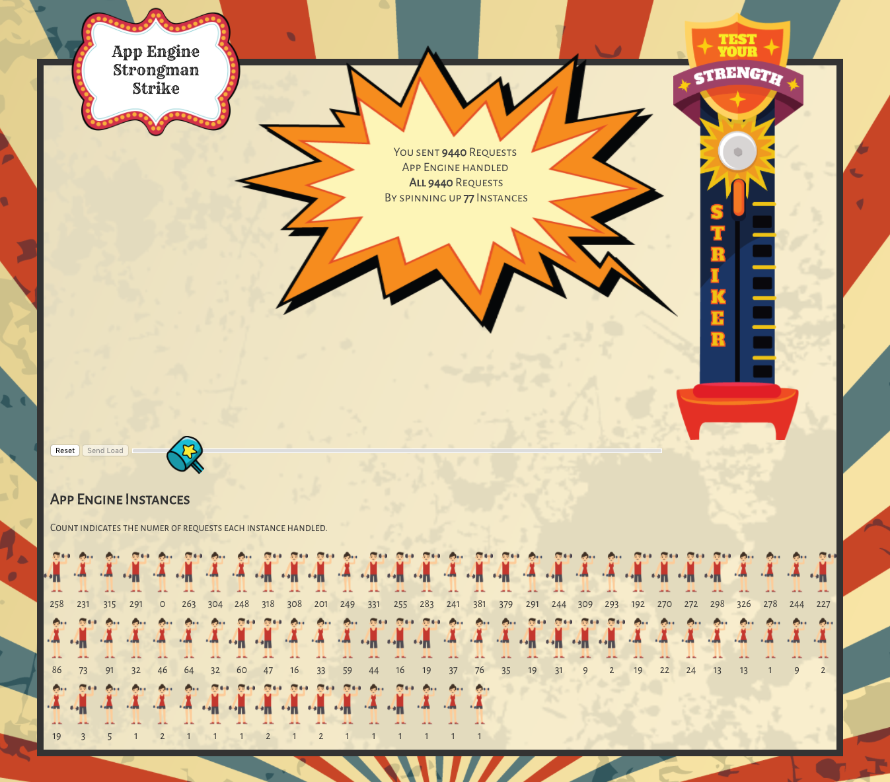

# Hammer Strike
This is a demo that shows how fast Appengine can spin up instances to handle
load that you send at it.  It simulates a hammer strike game where you hit the
pad with a hammer and ring the bell. This is another one of those demos that
means to be a be both a web demo and a IoT assisted physical game.

## Getting Started

### Create Project
1. Create Project in Cloud Console
1. Navigate to Compute Engine (to activate Compute Engine service)
1. Activate the same project in the Firebase Console

### Create Config
1. Make a copy of `/Samples.properties`, renamed to
`/Makefile.properties`
1. Alter value for `PROJECT` to your project id
1. Make a copy of
`/infrastructure/kubernetes/hammer-strike-deployment.sample.yaml`, renamed to `/infrastructure/kubernetes/hammer-strike-deployment.yaml`
1. Alter value for `image` to point to your project id
1. Make a copy of `/app/ui/static/js/firebaseconfig.sample.js`, renamed to
`/app/ui/static/js/firebaseconfig.js`
   - Alter values for `config` to point to valid values for your Firebase
   project
1. Make a copy of `/iot/firebaseconfig.sample.js`, renamed to
`/iot/firebaseconfig.js`
   - Alter values for `modules.export` to point to valid values for your
   Firebase project

### Build Infrastructure
1. Open a terminal in `/infrastructure/GKE`.
1. Run `make build`

### Build Application
1. Open a terminal in `/app/kubernetes/`.
1. Run `make deploy`

## Clean Up Application
1. Open a terminal in `/app/kubernetes/`.
1. Run `make clean`

## Clean Up Infrastructure
You don't have to do this, but you might want to recreate the servers at some
point.
1. Open a terminal in `/infrastructure/`.
1. Run `make clean`

## Using the app

### Stop Infrastructure
1. Open a terminal in `/infrastructure/`.
1. Run `make stop`

### Restart Infrastructure
1. Open a terminal in `/infrastructure/`.
1. Run `make start`
1. Run `make bounce`

### Restart services on VMs
1. Open a terminal in `/infrastructure/`.
1. Run `make bounce`

## Running the Physical Version

### Build
1. Refer to the [diagram](iot/diagram.png) to wire up the Arduino
1. Load the Firmata sketch to the Arduino
1. Open a terminal in `/iot/`.
1. Run `npm install`

### Run
1. Plug in the Arduino
1. Open a terminal in `/iot/`.
1. Run `npm start`
1. Make sure you have only ONE copy of the UI open in a web browser.
1. Hit the "Start" button on the device
1. Strike the Hammer within 10 seconds

## General Architecture
The App consists of 3 App Engine Services and one Container Engine Cluster.

<ul>
    <li>App Engine
        <ul>
            <li>
                <dl>
                    <dt>distributor</dt>
                    <dd>This service provides one endpoint for a frontend to
                    sendload to App Engine. It handles dividing the load
                    requested intoequal parts and sending it to each node of the
                    GKE clusterfor throttling through GKE using Apache Bench.
                    </dd>
                </dl>
            </li>
            <li>
                <dl>
                    <dt>load</dt>
                    <dd>This service is the part of the application that
                    receives and counts all of the load that the application
                    handles.</dd>
                </dl>
            </li>
            <li>
                <dl>
                    <dt>ui</dt>
                    <dd>This service is static hosting from the HTML/JS/CSS
                    fronend for the application. </dd>
                </dl>
            </li>
        </ul>
    </li>
     <li>Container Engine
        <ul>
            <li>
                <dl>
                    <dt>abrunner</dt>
                    <dd>This application in a container uses Apache Bench to
                    send load at load service from App Engine above.</dd>
                </dl>
            </li>
        </ul>
    </li>
</ul>

## API documentation
The front end of the application only hits one of the App Engine services in
this application.

<dl>
    <dt>/hammer-strike/distributor/report</dt>
    <dd>
        
Parameters:

        <ul>
            <li><strong>token:</strong> A key created by the client, that binds
            all of the traffic generated by this application into system.
            Allows the app to be able to be played by multiple clients at once,
            all with different sets of results.</li>
        </ul>
    </dd>
    <dd>
        
This app call gets a list of what is happening with App Engine. It
        should contain total request ad instance counts, App Engine instance
        names and request counts. A successful request should look like this:
        

    </dd>
    <dd>
<pre><code>
        {
            "request_count": 9960,
            "instance_count": 55,
            "instances": [{
                "name": "p7quc_00c61b117c51bd7c6ee9eb7b1d339b37f93f310aa5a88193edfde805f2df530b628a6c00a77c56",
                "requests": 94
            }, {
                "name": "p7quc_00c61b117cd17db1e069f166e71775f495eb1bd7a938441eae030957f80b28df7196f58246a6c124fbf65afdd0",
                "requests": 22
            },
            ...
            {
                "name": "p7quc_00c61b117c30a4881280a68d9db3c2aebb0fb05fc0247d263bc2e779e561e395692a409f89a2219b",
                "requests": 3
            }],
            "start": "1484349060671094892",
            "end": "1484349072133050210"
        }
</code></pre>
    </dd>
</dl>
<dl>
    <dt>/hammer-strike/distributor</dt>
    <dd>
        
Parameters:

        <ul>
            <li><strong>token:</strong> A key created by the client, that binds
            all of the trafficgenerated by this application into system.  Allows
            the app to be able to be playedby multiple clients at once, all with
            different sets of results.</li>
            <li><strong>n:</strong> The total amount of requests that you want
            to send at App Engine.</li>
        </ul>
    </dd>
</dl>

"This is not an official Google Project."